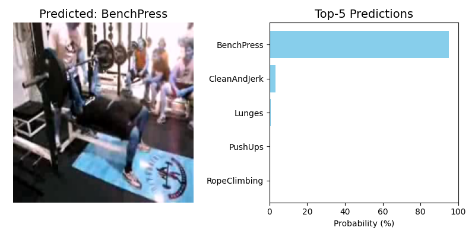
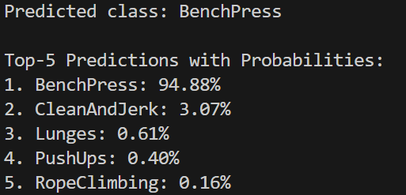

# Human Action Recognition

This project implements Human Action Recognition (HAR) on the UCF50 dataset.
The pipeline first extracts frame-level features using a pretrained ResNet backbone, and then classifies video sequences with temporal models: BiLSTM with Additive Attention or TCN with Temporal Attention.




## Dataset

[UCF50](https://www.crcv.ucf.edu/data/UCF50.php) contains **6,676 videos** across **50 action classes**.  
Each video belongs to one of 25 groups (g01–g25). We use the following protocol: groups 1–22 for training, groups 22–25 for testing.  
Videos vary in length (minimum ~28 frames) and resolution.

## Models 

### 1. BiLSTM + Additive Attention
- **Encoder**: Pretrained ResNet extracts a 2048-D feature vector per frame.  
- **Temporal Model**: Bidirectional LSTM processes the sequence of frame features.  
- **Attention**: Bahdanau-style Additive Attention pools hidden states into a weighted context vector.  
- **Classifier**: Fully-connected layer outputs class probabilities.  

### 2. TCN + Temporal Attention
- **Encoder**: Same ResNet feature extractor.  
- **Temporal Model**: Temporal Convolutional Network (TCN) with dilated 1D convolutions to capture long temporal dependencies.  
- **Attention**: Temporal Attention highlights important timesteps.  
- **Classifier**: Fully-connected layer for final classification. 

## 📂 Repository Structure

```
HAR-Project/
├── data/
│ └── UCF50 # Videos
│ └── classes.txt # List of action classes
├── output/
│ └── checkpoints/ # Saved model weights
│ └── ucf50_features ## Extracted frame features
│ └── train 
│ └── test 
├── models.py # BiLSTM and TCN classifiers
├── extract_frames.py # Frame extraction utility
├── train.py # Training script
├── validate.py # Validation script
├── test_video.py # Inference on a single video
├── README.md
└── requirements.txt
```

## Install required packages

```
pip install -r requirements.txt
```

## Download Dataset
Use the provided shell script to download and organize the dataset:

```
sudo apt-get install unrar
cd data
bash download_ucf50.sh
```

## Extract Frame Features

Extract **24 frames per video** and save as `.pt` tensors with ResNet features using the following command:

```
python extract_frames.py --video_root data/UCF50 --save_root output/ucf50_features --classes_file data/classes.txt --num_frames 24
```
Each video is saved as a tensor of shape `(num_frames, 2048)`.

## Training

## For LSTM
Use the following command:
```
python main.py --feature_root output/ucf50_features --output_root output --model bilstm  --epochs 10  --batch_size 64  --lr 1e-3
```
## For TCN
Use the following command:
```
python main.py --feature_root output/ucf50_features --output_root output --model tcn  --epochs 10  --batch_size 64  --lr 1e-3
```

For more information about arguments to pass. Refer to the help message:
```
usage: main.py [-h] --feature_root FEATURE_ROOT [--output_root OUTPUT_ROOT] [--model {bilstm,tcn}] [--input_dim INPUT_DIM]
               [--hidden_dim HIDDEN_DIM] [--num_layers NUM_LAYERS] [--dropout DROPOUT] [--batch_size BATCH_SIZE]
               [--epochs EPOCHS] [--lr LR]

Human Action Recognition with BiLSTM/TCN + Attention

options:
  -h, --help            show this help message and exit
  --feature_root FEATURE_ROOT
                        Path to pre-extracted features (organized per class)
  --output_root OUTPUT_ROOT
                        Path to save splits, logs, models
  --model {bilstm,tcn}  Which model to use: bilstm or tcn
  --input_dim INPUT_DIM
  --hidden_dim HIDDEN_DIM
  --num_layers NUM_LAYERS
  --dropout DROPOUT
  --batch_size BATCH_SIZE
  --epochs EPOCHS
  --lr LR
```

## Results

After training on UCF50 (groups 1–22 for training, groups 23–25 for testing), the top-1 validation accuracy for the model is shown

> **Note:** Validation accuracy is computed on the test split (groups 23–25).  
> These numbers correspond to the **best model checkpoints** saved during training.

## Make Prediction for a Video

After training, run inference on a single video using the following command:

```
test_video.py --video_path [path to video]  --model_type [bilstm/tcn]
```

